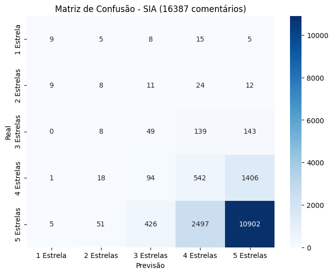
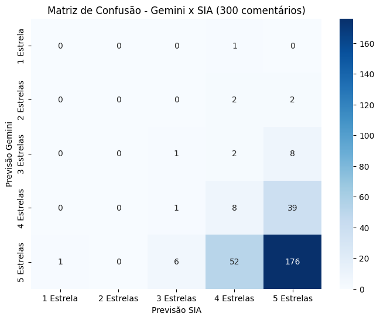

# Análise de Sentimentos de um Restaurante Utilizando NLP

## Introdução 

Este projeto tem como objetivo explorar a aplicação de técnicas de processamento de linguagem natural (PLN) na análise de sentimentos de avaliações de clientes de um restaurante. Para isso, foram utilizadas duas abordagens principais: a API Gemini, uma solução avançada baseada em modelos de aprendizado de máquina, e o SentimentIntensityAnalyzer (SIA), uma ferramenta da biblioteca NLTK.

### Identificação 

* Augusto César da Silva Carvalho, 20230029867
* Rita de Cassia Melo Nascimento, 20210017617

[Link do vídeo explicando o projeto](https://www.youtube.com/watch?v=y6yhIZKtERk)

---

## Objetivo

A base de dados contém informações sobre as avaliações feitas por usuários acerca do restaurante *Camarões* na plataforma *TripAdvisor*, com o objetivo de analisar os sentimentos e as tendências de satisfação. A base será utilizada para o treinamento de modelos de machine learning para previsão de avaliações, contribuindo para a compreensão do comportamento dos consumidores e para a tomada de decisões estratégicas.

---

## Fonte dos Dados

Os dados utilizados neste projeto foram extraídos do site TripAdvisor por meio de uma técnica de Web Scraping, que consiste em coletar informações diretamente do HTML do site. Durante a extração, foram capturados os títulos dos comentários (que tiveram pouca relevância na análise), o texto completo dos comentários e suas respectivas avaliações, variando de 1 a 5 estrelas. Os dados foram coletados até o final de dezembro de 2024, de forma que novas avaliações feitas após essa data não estão presentes no banco de dados.

Abaixo, segue um exemplo do formato do banco de dados utilizado:

| Título                      | Comentário                                                   | Estrelas |
|-----------------------------|--------------------------------------------------------------|----------|
| "Ótima comida e ambiente!"   | "O ambiente é perfeito para um jantar a dois. A comida estava deliciosa e o atendimento muito bom!" | 5        |
| "Decepção com o serviço"     | "A comida estava boa, mas o atendimento foi muito demorado. Não voltarei tão cedo." | 2        |
| "Recomendo a todos!"         | "Comida excelente, ambiente agradável e ótimo atendimento. Recomendo a todos!" | 4        |

O resultado dessa coleta foi consolidado em um arquivo [CSV](csv_folder/camaroes.csv) contendo **16.387 avaliações**, utilizado posteriormente para as análises realizadas neste projeto. O código responsável pelo Web Scraping pode ser encontrado neste [arquivo](code_folder/camaroes_webscraping.ipynb).

### Limitações

- **Representatividade**: A base contém apenas avaliações de um único restaurante, o que pode limitar a generalização dos resultados para outros estabelecimentos.
- **Possíveis viéses**: A maioria das avaliações podem ser de clientes altamente satisfeitos ou insatisfeitos, o que pode afetar a distribuição das avaliações.

---

## Métodos Utilizados

Para a análise de sentimentos e previsão das avaliações, foram utilizados os modelos **SIA** (Sentiment Intensity Analyzer) e **Gemini**.

### Gemini API

A **Gemini API** é uma interface desenvolvida pela Google que permite integrar funcionalidades avançadas de processamento de linguagem natural (PLN) diretamente em aplicações Python. Esta API é projetada para realizar tarefas como análise de sentimentos, reconhecimento de entidades, tradução de texto e detecção de emoções, entre outras.

No contexto deste projeto, a API do Gemini foi usada para análise de sentimentos e previsão de avaliações de clientes. Ela oferece acesso a modelos robustos treinados para lidar com textos em diversas línguas e realizar tarefas complexas de PLN. Embora a plataforma Gemini seja comumente utilizada por meio de interfaces gráficas, a API permite automação e integração em sistemas personalizados, aumentando a eficiência e a escalabilidade.

O processo típico de uso envolve enviar uma solicitação com o texto a ser analisado e receber como resposta uma análise detalhada. No caso deste projeto, as avaliações foram processadas em lotes pequenos devido às limitações de uso gratuito da API, o que impactou o volume total de dados analisados.

### SentimentIntensityAnalyzer

O **SentimentIntensityAnalyzer (SIA)** é uma ferramenta da biblioteca **NLTK** (Natural Language Toolkit) voltada para a análise de sentimentos. Ele avalia o texto e gera pontuações que indicam a polaridade e a intensidade emocional do conteúdo, utilizando um modelo baseado em léxico.

O SIA gera quatro pontuações principais:
1. **Positivo (pos)**: Quão positivo o texto é.
2. **Negativo (neg)**: Quão negativo o texto é.
3. **Neutro (neu)**: Quão neutro o texto é.
4. **Compound**: Uma pontuação agregada que reflete o sentimento geral do texto, variando de -1 (extremamente negativo) a +1 (extremamente positivo).

A ferramenta é especialmente eficaz para analisar textos curtos, como resenhas ou comentários em redes sociais, oferecendo uma solução prática e rápida. Contudo, pode apresentar limitações em casos de textos mais longos, ambíguos ou que contenham sarcasmo.

---

## Metodologia  

### SentimentIntensityAnalyzer

A técnica de *machine learning* utilizada neste projeto foi o Processamento de Linguagem Natural (Natural Language Processing - NLP). Essa área da inteligência artificial é voltada para a interação entre humanos e máquinas por meio da linguagem natural. O NLP permite que computadores processem, analisem e interpretem textos ou falas humanas, identificando padrões e extraindo informações relevantes.  

A aplicação específica foi a análise de sentimentos, uma abordagem que utiliza modelos de NLP para classificar emoções ou opiniões expressas em textos, como positivas, negativas ou neutras. Para este estudo, os dados analisados foram os comentários de avaliação do restaurante Camarões.

O primeiro passo foi o [tratamento dos dados textuais](#Etapas-de-Normalização-dos-Textos), deixando os comentários normalizados para facilitar a interpretação pelo modelo **SIA (SentimentIntensityAnalyzer)**.

Após isso foi aplicado o método ```sia.polarity_scores()``` em cada elemento da lista contendo os comentarios:

```python
for i, row in data.iterrows():
    text = row['Coments_norm']
    text_t = traduzir(text)
    text_t_norm = text_normalizer(text_t)
    time.sleep(2)
    pol.append(sia.polarity_scores(text_t_norm))
    data.loc[i, 'Coments_norm'] = text_t_norm
```

Para que o método do **SIA** funcionasse, foi necessário traduzir os comentários, originalmente, em português (na grande maioria dos casos), para inglês. A tradução foi realizada com a biblioteca **googletrans**, utilizando a seguinte função:  
```for``` anterior:

```python
def traduzir(text):
    translator = Translator()
    traducao = translator.translate(str(text), dest='en').text
    return traducao
```

A partir das pontuações geradas pelo SIA, foi realizada uma previsão da avaliação do usuário, convertendo os sentimentos em notas de 1 a 5 estrelas. Após análises e testes cuidadosos, chegou-se a uma lógica que considera as variáveis `compound`, `pos`, `neg` e `neu` para atribuir as estrelas:

```python
for score in pol:
    compound = score['compound']
    neg = score['neg']
    neu = score['neu']
    pos = score['pos']

    if compound >= 0.7 and pos > neg and pos > neu/2:
        sia_stars.append(5)  # Muito positivo
    elif compound >= 0.3 and pos > neg:
        sia_stars.append(4)  # Positivo
    elif compound >= 0.05 and pos > neg - 0.1 and pos > neu/3:
        sia_stars.append(3) # Neutro tendendo ao positivo
    elif compound <= -0.7 and neg > pos:
        sia_stars.append(1)  # Muito negativo
    elif compound <= -0.3 and neg > pos :
        sia_stars.append(2)  # Negativo
    elif neg > pos + 0.2 and neg > neu/3 :
        sia_stars.append(2) # Neutro tendendo ao negativo
    else:
        sia_stars.append(3)  # Neutro
```

Os resultados finais, contendo as previsões de estrelas para cada comentário, foram salvos no arquivo [CSV](csv_folder/camaroes_sia_stars.csv), para ser analiado posteriormente. E o código completo pode ser encontrado [aqui](code_folder/camaroes_sentiment.py).

### Gemini API

A API do Gemini permite utilizar a inteligência artificial de forma similar à sua plataforma, possibilitando o uso de prompts diretamente no código. Além disso, a API pode ser empregada para processar variáveis de texto, automatizar prompts, entre outras funcionalidades.

No entanto, a API possui limitações de uso gratuito, que são restabelecidas após algumas horas, e exige um plano pago para volumes maiores. Para lidar com essa restrição, foi implementada uma estratégia que seleciona um pequeno intervalo de comentários (no máximo 50), definido pelo usuário, para análise em cada execução. Isso evita exceder os limites gratuitos da API.

O código abaixo solicita ao usuário a escolha de um intervalo válido para análise:

```python
print(f"Escolha um intervalo de 50 comentários, dentre {len(df)} comentários, para o Gemini analisar:")

a = 1
b = 0
max = 50
while int(a)>int(b) or int(a)<0 or int(b)>len(df) or int(b)-int(a)>max:
    a = input("Início: ")
    b = input("Fim: ")
    if not a.isnumeric() or not b.isnumeric():
        print("Intervalo inválido, digite novamente. Apenas números são permitidos.")
        a = 1
        b = 0
    elif int(a)>int(b) or int(a)<0 or int(b)>len(df):
        print("Intervalo inválido, digite novamente")
    elif int(b)-int(a)>max:
        print("Intervalo muito grande, digite novamente")
```
Após definir o intervalo, as análises de sentimentos foram realizadas utilizando um único prompt. O prompt pede ao Gemini que analise os comentários e adivinhe a nota atribuída pelos clientes (de 1 a 5 estrelas). Segue o código utilizado:

```python
try:
    prompt = (
        f"Aqui está um pequeno trecho do meu banco de dados:\n{dados.to_string()}\n"
        f"Agora tente adivinhar a nota dada pelos clientes dos comentários de 1 a 5 estrelas. "
        f"Envie sua avaliação sem explicações, apenas com os números formatados da seguinte forma: "
        f"índice:quantidade de estrelas"
    )
    response = chat.send_message(prompt)
    print(response.text)

    time.sleep(10)
except:
    print("Gemini fora do ar")
```

O uso de `try`/`except` foi necessário, considerando a possibilidade de instabilidade da API. Além disso, o `time.sleep(10)` foi incluído para evitar sobrecarga na API e respeitar os limites de requisições. Essa abordagem permitiu realizar análises contínuas e armazenar os resultados em um arquivo CSV, sem exceder os custos do serviço.

Os resultados das análises foram salvos no arquivo [CSV](csv_folder/camaroes_gemini_stars.csv), onde as avaliações eram [constantemente adicionadas](#Etapas-para-Atualização-das-Avaliações-do-Gemini), permitindo o acompanhamento contínuo sem ultrapassar os custos associados ao uso excessivo da API. Essa estratégia ajudou a minimizar os gastos, mas não resolveu completamente o problema da limitação de volume de requisições, pois ainda assim era necessário aguardar um tempo para fazer outra requisição. 

O código completo pode ser encontrado [aqui](code_folder/camaroes_gemini.ipynb).

---

### Outros códigos

#### Etapas de Normalização dos Textos

Abaixo estão as funções utilizadas no processo de normalização dos textos, com breves explicações:

1. **converter_minusculo(text)**
   
   - Converte todo o texto para letras minúsculas, garantindo uniformidade.
     
```python
def converter_minusculo(text):
    return text.lower()
```

2. **remove_espaco_branco(text)**
   
   - Remove espaços em branco extras no início e no fim do texto.
     
```python
def remove_espaco_branco(text):
    return text.strip()
```

3. **remove_pontuacao(text)**
   
   - Remove pontuações do texto, exceto apóstrofos, para reduzir ruídos.
     
```python
def remove_pontuacao(text):
    punct_str = string.punctuation
    punct_str = punct_str.replace("'", "")
    translator = str.maketrans("", "", punct_str)
    return text.translate(translator)
```

4. **remove_emoji(text)**
   
   - Remove emojis usando um padrão Unicode, deixando o texto mais limpo.
     
```python
def remove_emoji(text):
    emoji_pattern = re.compile("["
        u"\U0001F600-\U0001F64F"
        u"\U0001F300-\U0001F5FF"
        u"\U0001F680-\U0001F6FF"
        u"\U0001F1E0-\U0001F1FF"
        u"\U00002702-\U000027B0"
        u"\U000024C2-\U0001F251"
        "]+", flags=re.UNICODE)
    return emoji_pattern.sub(r"", text)
```

5. **remove_http(text)**
   
   - Remove URLs presentes no texto utilizando expressões regulares.
     
```python
def remove_http(text):
    http = r"https?:\/\/(?:www\.)?[-a-zA-Z0-9@:%._\+~#=]{1,256}\.[a-zA-Z0-9()]{1,6}\b(?:[-a-zA-Z0-9()@:%_\+.~#?&\/=]*)"
    pattern = re.compile(http, re.IGNORECASE)
    return pattern.sub("", text)
```

6. **remove_stopwords(text)**
   
   - Remove palavras comuns sem relevância semântica (stopwords), como "de", "o", "a", foram excluídas.
     
```python
regexp = RegexpTokenizer(r"\b\w+\b")
linguas = ['portuguese', 'english', 'spanish', 'french']
stops = []
for lingua in linguas:
    stops += nltk.corpus.stopwords.words(lingua)
def remove_stopwords(text):
    return " ".join([word for word in regexp.tokenize(text) if word not in stops])
```

7. **text_normalizer(text)**
   
   - Combina todas as funções acima em uma única sequência de normalização:
     
```python
def text_normalizer(text):
    text = unidecode.unidecode(text)
    text = re.sub('\n', '', text)
    text = remove_http(text)
    text = remove_emoji(text)
    text = remove_pontuacao(text)
    text = remove_espaco_branco(text)
    text = converter_minusculo(text)
    text = remove_stopwords(text)
    return text
```

O código completo pode ser achado neste [arquivo](code_folder/camaroes_sentiment.py).

#### Etapas para Atualização das Avaliações do Gemini

Este código atualiza um arquivo CSV com avaliações processadas pela API Gemini, evitando duplicações e garantindo organização. Abaixo está a explicação de cada bloco:

1. **Conversão Segura de Valores**

  - Função para tentar converter valores em `int` ou `float`. Caso a conversão falhe, retorna o valor original.

```python
def safe_convert(value):
    try:
        return int(value)
    except ValueError:
        try:
            return float(value)
        except ValueError:
            return value
```

2. **Leitura do Arquivo CSV**
   
  - Lê o arquivo CSV especificado no caminho.
  - Converte os valores usando a função `safe_convert`.
  - Ignora o cabeçalho. Se o arquivo não existir, inicia com uma lista vazia.
    
```python
listarquivo = []
try:
    with open(caminho, "r") as arquivo:
        reader = csv.reader(arquivo)
        next(reader, None)
        listarquivo = [[safe_convert(x) for x in row] for row in reader]
except FileNotFoundError:
    listarquivo = []
```

3. **Tratamento e Filtragem de Valores no Arquivo**

  - Garante que os valores no arquivo sejam convertidos para números (`int` ou `float`), sempre que possível.
  - Extrai os números dos comentários existentes no arquivo para evitar duplicações.
  - Converte os novos dados (`gemilist`) e filtra os comentários que já existem no arquivo.
  - Adiciona ao arquivo somente os dados filtrados que não estavam presentes anteriormente.

```python
listarquivo = [[int(x) if isinstance(x, str) and x.isdigit() else float(x) if isinstance(x, str) and x.replace('.', '', 1).isdigit() else x for x in row] for row in listarquivo]
existing_comment_numbers = [int(row[0]) for row in listarquivo if isinstance(row[0], (int, float))]
gemilist = [[int(x) if isinstance(x, str) and x.isdigit() else float(x) if isinstance(x, str) and x.replace('.', '', 1).isdigit() else x for x in row] for row in gemilist]
gemilist_filtered = [row for row in gemilist if int(row[0]) not in existing_comment_numbers]
if gemilist_filtered:
    with open(caminho, "a", newline='') as arquivo:
        writer = csv.writer(arquivo)
        writer.writerows(gemilist_filtered)
```

4. **Ordenação dos Dados e Regravação do Arquivo com Cabeçalho**

  - Recarrega o arquivo atualizado e ordena os dados pelo número do comentário em ordem crescente.
  - Reescreve o arquivo, adicionando o cabeçalho e os dados ordenados.
  
```python
try:
    with open(caminho, "r") as arquivo:
        reader = csv.reader(arquivo)
        next(reader, None)
        dados = list(reader)
except FileNotFoundError:
    dados = []

dados.sort(key=lambda row: int(row[0]))

with open(caminho, "w", newline='') as arquivo:
    writer = csv.writer(arquivo)
    writer.writerow(["Número do Comentário", "Estrelas Gemini"])
    writer.writerows(dados)
```

O código completo pode ser achado neste [arquivo](code_folder/camaroes_gemini.ipynb).

---

## Resultados

Após a obtenção dos dois arquivos CSV, foi realizada uma análise para avaliar a precisão das previsões feitas pelo Gemini e pelo SentimentIntensityAnalyzer (SIA). Para isso, foram construídas matrizes de confusão comparando as previsões de cada método com as avaliações reais dos clientes. Em seguida, foi calculada a acurácia de cada modelo de avaliação.

Uma matriz de confusão é uma ferramenta utilizada para avaliar o desempenho de modelos de classificação. Ela mostra a relação entre os valores previstos e os valores reais, e neste projeto ela foi lida considerando a diagonal principal como previsões corretas, e as casas vizinhas a diagonal principal como "meio-certas". Sendo assim foi possível identificar como o modelo está acertando ou errando em cada categoria.

A biblioteca `sklearn.metrics` fornece a função `accuracy_score()` para calcular a acurácia de um modelo. Ela considera uma previsão correta apenas quando o modelo acerta exatamente a avaliação original. Por exemplo:
- Se o Gemini previu 4 estrelas e a avaliação original era 5 estrelas, o `accuracy_score()` classifica essa previsão como incorreta, mesmo estando muito próxima do valor correto.

Para ajustar a análise e considerar previsões próximas como parcialmente corretas, foi criado o seguinte código:

```python
def calculate_modified_accuracy(df, prediction_col, actual_col):
    correct_predictions = 0
    total_predictions = len(df)

    for index, row in df.iterrows():
        predicted_stars = row[prediction_col]
        actual_stars = row[actual_col]
        if abs(predicted_stars - actual_stars) == 0:
            correct_predictions += 1
        if abs(predicted_stars - actual_stars) == 1:
            correct_predictions += 0.8
    return correct_predictions / total_predictions
```

Este código foi desenvolvido para calcular uma métrica de acurácia ajustada, que considera previsões próximas ao valor real como parcialmente corretas. O objetivo é oferecer uma avaliação mais flexível e realista do desempenho do modelo, especialmente em casos onde uma previsão exata pode ser difícil, mas a proximidade ainda reflete um bom resultado.

O código recebe como entrada um DataFrame contendo os dados analisados, o nome da coluna com as previsões do modelo (`prediction_col`) e o nome da coluna com os valores reais fornecidos pelos usuários (`actual_col`). Ele percorre cada linha do DataFrame, calcula a diferença absoluta entre a previsão e o valor real e adiciona pontos de acordo com a proximidade. 

Se a previsão for exata (diferença igual a 0), ela é considerada totalmente correta e soma 1 ponto à contagem. Caso a previsão esteja próxima (diferença de 1), ela ainda é considerada parcialmente correta, somando 0.8 pontos. Ao final do processo, o total de pontos acumulados é dividido pelo número total de previsões para calcular a acurácia modificada.

Este método permite uma avaliação mais flexível dos modelos, reconhecendo previsões próximas como parcialmente corretas. Isso ajuda a medir o desempenho de forma mais justa, especialmente em contextos onde uma previsão aproximada ainda é útil.

### Análise das Avaliações do Gemini

A matriz de confusão do Gemini foi gerada utilizando uma amostra de 300 comentários selecionados aleatoriamente do banco de dados coletado do restaurante. Essa abordagem foi necessária devido às limitações do uso gratuito da API, o que impossibilitou a análise de todos os comentários disponíveis. Por conta disso, a acurácia apresentada pode ser inferior ao que seria observado caso todo o conjunto de dados tivesse sido analisado.

A matriz de confusão das avaliações do Gemini está ilustrada abaixo:


A análise revelou que a maioria dos comentários coletados foram positivos. O Gemini demonstrou um desempenho satisfatório, com uma boa correspondência entre suas avaliações e as opiniões reais dos clientes, mesmo com as limitações impostas pela amostragem reduzida.

A acurácia do Gemini, calculada utilizando a função `accuracy_score()`, foi de **66%**. Embora esse valor pareça relativamente baixo, ele não reflete adequadamente a realidade. Por exemplo, um cliente que avaliou o restaurante com 4 estrelas provavelmente teve uma experiência positiva, mas não suficiente para justificar 5 estrelas. Para lidar com isso, foi utilizada a função `calculate_modified_accuracy()`, que atribui um peso um pouco menor para avaliações que chegaram próximas da nota real. Com essa abordagem, a acurácia foi aumentada para **87%**, um resultado mais coerente e representativo para este caso específico.

### Análise das Avaliações do SentimentIntensityAnalyzer

Para a avaliação do SIA, foram geradas duas matrizes de confusão, uma para a avaliação de todos os comentários do banco de dados, e outra para os mesmos comentarios analizados pelo Gemini, para posteriormente ser feita uma comparação mais adequada entre os dois métodos.

Segue abaixo a matriz de confusão referente aos mesmos comentários avaliados pelo Gemini:  


Essa matriz revelou que a maioria dos comentários coletados foram positivos. O SentimentIntensityAnalyzer (SIA) apresentou um desempenho semelhante ao do Gemini, porém um pouco melhor, mesmo analisando exatamente os mesmos comentários.

A acurácia, calculada com a função `accuracy_score()`, foi de **69%**. No entanto, ao aplicar o método `calculate_modified_accuracy()`, a acurácia subiu para **90%**, demonstrando consistentemente uma melhora de 3% em relação à avaliação realizada pelo Gemini.

Segue abaixo matriz de confusão referente a todos os comentários do banco de dados:



Essa matriz demonstrou que a maioria das avaliações foi positiva, com uma quantidade significativa de previsões nas casas vizinhas da diagonal principal. Isso indica que o modelo frequentemente errou por apenas uma diferença de 1 estrela, o que é um ótimo desempenho, especialmente considerando a grande quantidade de comentários no banco de dados (mais de 16 mil).

Se apenas a função `accuracy_score()` tivesse sido utilizada, milhares comentários positivos teriam sido desconsiderados, mesmo com a acurácia subindo para 70%. No entanto, ao aplicar a função `calculate_modified_accuracy()`, a acurácia permaneceu em 90%, refletindo uma avaliação mais justa e precisa da qualidade do modelo.

### Análise das Avaliações do Gemini vs SIA

Para comparar os dois métodos, foi elaborada uma quarta matriz de confusão, que analisou as avaliações do Gemini e do SIA lado a lado, considerando a mesma quantidade de comentários. Neste caso, a acurácia não foi calculada, já que nenhum dos métodos reflete os valores reais das avaliações.

A seguir está ilustrada a matriz de confusão que compara ambos os métodos:



Como mostrado na matriz, muitas avaliações positivas coincidiram entre os dois métodos. No entanto, uma quantidade considerável de avaliações apresentou uma diferença entre 4 e 5 estrelas. Esse desvio ainda seria levado em conta na análise deste projeto, já que ambos os valores indicam uma diferença de uma estrela apenas. É importante ressaltar que esta matriz foi criada com o objetivo de oferecer uma comparação gráfica direta entre os métodos e não para representar os valores reais das avaliações.

O código completo, incluíndo a formação das matrizes, pode ser achado neste [arquivo](code_folder/camaroes_gemini_vs_sia.ipynb).

---

## Conclusão

A análise realizada neste projeto comparou dois métodos diferentes de avaliação de sentimentos: o Gemini e o SentimentIntensityAnalyzer. Cada método foi avaliado por meio de métricas objetivas, incluindo matrizes de confusão e cálculos de acurácia, além de análises gráficas das diferenças e semelhanças entre as avaliações.

O Gemini apresentou uma acurácia inicial de **66%** utilizando a métrica `accuracy_score()` e melhorou para **87%** quando avaliado com a função personalizada `calculate_modified_accuracy()`. Já o **SIA** demonstrou um desempenho ligeiramente superior, com uma acurácia de **69%** utilizando `accuracy_score()` e atingindo **90%** com a métrica personalizada. Essa diferença mostra que o SIA teve uma performance mais consistente, mesmo analisando uma quantidade significativamente maior de dados.

Ao comparar os dois métodos diretamente, foi constatado que ambos tendem a classificar a maioria dos comentários como positivos. No entanto, divergências em torno de avaliações de 4 e 5 estrelas foram frequentes, destacando diferenças na sensibilidade de cada método. Apesar dessas diferenças, ambos mostraram resultados satisfatórios na análise de sentimentos, sendo capazes de identificar avaliações positivas, negativas e neutras de forma coerente.

A utilização da métrica personalizada de acurácia se mostrou essencial para avaliar de forma mais justa os métodos analisados. Ao considerar como parciais as avaliações com diferença de até uma estrela, foi possível capturar um desempenho mais próximo da realidade, evitando penalizações injustas a modelos que, apesar de não serem completamente precisos, ainda geram insights valiosos.

Por fim, o projeto demonstrou a viabilidade de aplicar métodos de processamento de linguagem natural na análise de sentimentos de avaliações de clientes. Ambos os modelos forneceram uma boa base para a análise, mas o SIA apresentou um leve destaque, especialmente pela sua eficiência ao lidar com um volume maior de dados. Porém, não é sabido se o Gemini apresentaria um resultado superior ao SIA, ou se diminuiria sua acurácia, caso tivesse analisado todas os comentários. Portanto, embora não tenha sido possível determinar um modelo ideal, o SIA se destaca como uma escolha prática e confiável, especialmente por não possuir as limitações de uso impostas pelo Gemini. Dessa forma, para cenários onde a escalabilidade e a análise de grandes volumes de dados são fundamentais, o SIA se mostra uma opção mais viável.

Uma sugestão para aprimorar este projeto seria coletar também as datas das avaliações. Essa adição permitiria realizar uma análise temporal, identificando períodos em que o restaurante teve um desempenho melhor ou pior. Com isso, seria possível fornecer informações mais robustas para a gestão, ajudando na tomada de decisões estratégicas e na identificação de tendências ou problemas ao longo do tempo.
   
---
